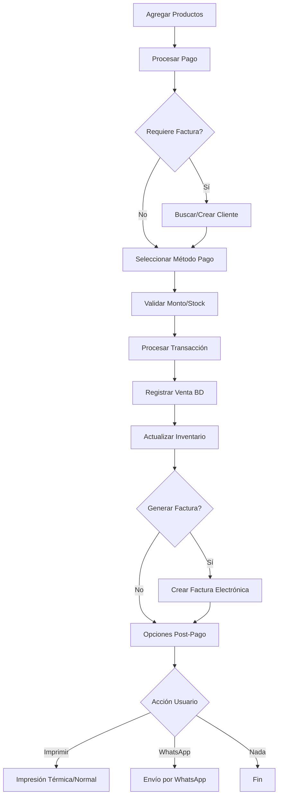

# 🎯 Sistema POS Completo - Resumen de Implementación

## ✅ Funcionalidades Implementadas

### 🔄 Flujo Completo de Pago
- [x] **Selección de métodos de pago** (Efectivo, Tarjeta, Transferencia, QR, Link)
- [x] **Calculadora de vueltas** para pagos en efectivo
- [x] **Validación de montos** y stock de productos
- [x] **Integración con cliente** para facturación electrónica
- [x] **Procesamiento automático** de transacciones

### 🗄️ Base de Datos Completa
- [x] **Registro de ventas** (`sales` table)
- [x] **Detalle de productos vendidos** (`detail_sales` table)  
- [x] **Facturas electrónicas** (`invoices` table)
- [x] **Gestión de clientes** (`clients` table)
- [x] **Actualización automática de inventario** 
- [x] **Búsqueda de clientes por documento**

### 🧾 Facturación Electrónica (DIAN)
- [x] **Estructura XML UBL 2.1** preparada para DIAN Colombia
- [x] **Generación de CUFE** y códigos QR
- [x] **Plantillas HTML/PDF** para facturas
- [x] **Validación de cliente** requerida para facturación
- [x] **Cálculo automático de IVA** (19%)
- [x] **Numeración automática** de facturas

### 🖨️ Sistema de Impresión Dual
- [x] **Impresión térmica** (58mm, 60mm, 80mm)
- [x] **Impresión normal** (A4) para facturas completas
- [x] **Auto-detección** de impresoras disponibles
- [x] **Configuración dinámica** de ancho de papel
- [x] **Vista previa** y diálogo de impresión

### 📱 Integración WhatsApp
- [x] **Envío automático** de facturas y comprobantes
- [x] **Mensajes predefinidos** personalizables
- [x] **Validación de números** telefónicos colombianos (+57)
- [x] **Apertura automática** de WhatsApp Web
- [x] **Vista previa** de mensajes antes del envío

### ⚙️ Sistema de Configuración
- [x] **Panel de administración** completo
- [x] **Configuración de empresa** (nombre, NIT, dirección, etc.)
- [x] **Configuración de facturación** (DIAN, certificados, resolución)
- [x] **Configuración de WhatsApp** (número de empresa, templates)
- [x] **Configuración de impresión** (térmicas y normales)
- [x] **Exportar/Importar configuración**
- [x] **Restaurar valores por defecto**

## 🏗️ Arquitectura Técnica

### Backend (Electron)
```
electron/
├── config.json                 # Configuración base del sistema
├── config.service.js           # Servicio de gestión de configuración
├── db.js                       # Base de datos SQLite + nuevas funciones
├── invoicing.service.js        # Servicio de facturación electrónica
├── printing.service.js         # Servicio de impresión (térmica + normal)
├── whatsapp.service.js         # Servicio de integración WhatsApp  
├── main.js                     # Handlers IPC + inicialización servicios
└── preload.js                  # APIs expuestas al frontend
```

### Frontend (Angular)
```
src/app/
├── components/
│   ├── payment-methods/        # Componente de pago completo
│   └── settings/              # Panel de configuración
└── services/
    ├── payment.service.ts      # Procesamiento real de pagos
    └── electron.service.ts     # Comunicación IPC actualizada
```

## 🔄 Flujo de Operación

### 1. Proceso de Venta Completo


### 2. Datos Registrados por Transacción
- ✅ **Venta**: fecha, total, cliente (si aplica)
- ✅ **Detalle**: productos, cantidades, precios
- ✅ **Factura**: número, CUFE, estado, archivo PDF
- ✅ **Inventario**: stock actualizado automáticamente

## 🎛️ Panel de Configuración

### Pestañas Disponibles:
1. **🏢 Empresa**: Datos básicos (nombre, NIT, dirección, contacto)
2. **📄 Facturación**: Configuración DIAN (resolución, certificados, IVA)
3. **💬 WhatsApp**: Número empresa + templates de mensajes
4. **🖨️ Impresión**: Configuración impresoras térmicas y normales

### Funciones Avanzadas:
- **Exportar/Importar** configuración completa
- **Restaurar valores por defecto**
- **Pruebas de impresión** 
- **Vista de impresoras disponibles**

## 🚀 Cómo Usar el Sistema

### Configuración Inicial:
1. Ir a **Configuración** desde el menú principal
2. Completar **datos de empresa** (obligatorio)
3. Configurar **facturación electrónica** (si aplica)
4. Configurar **WhatsApp** (opcional)
5. Probar **impresoras** disponibles

### Operación Diaria:
1. **Agregar productos** al carrito en "Ventas"
2. Hacer clic en **"Procesar Pago"**
3. Seleccionar **método de pago**
4. Marcar **"Requiere factura"** si es necesario
5. **Buscar/crear cliente** (solo si requiere factura)
6. **Confirmar pago**
7. Elegir **acción post-pago** (imprimir, WhatsApp, etc.)

## 📊 Datos para Reportes

El sistema almacena datos estructurados para futuros reportes:

### Ventas:
- Fecha y hora de venta
- Total vendido
- Cliente asociado (si aplica)
- Método de pago utilizado

### Productos:
- Productos más vendidos
- Cantidad vendida por producto
- Movimiento de inventario
- Stock actual vs vendido

### Clientes:
- Clientes con más compras
- Facturas generadas por cliente
- Contactos para marketing

### Facturación:
- Facturas electrónicas generadas
- Estado de facturas ante la DIAN
- Totales facturados vs no facturados

## 🔧 Personalización Avanzada

### Agregar Nuevos Métodos de Pago:
1. Editar `config.json` → sección `payments.methods`
2. Agregar lógica específica en `payment-methods.component.html`
3. Implementar handler en backend si es necesario

### Personalizar Templates WhatsApp:
1. Ir a Configuración → WhatsApp
2. O editar directamente en `config.json` → `whatsapp.messageTemplates`

### Configurar Certificados DIAN:
1. Obtener certificado digital de la DIAN
2. Editar `invoicing.service.js` → configurar rutas y passwords
3. Configurar endpoints de producción

## 🛠️ Troubleshooting

### Problemas Comunes:

**Error de impresión:**
- Verificar que la impresora esté encendida y conectada
- Usar "Ver Impresoras" en Configuración

**No se genera factura:**
- Verificar que el cliente tenga todos los datos requeridos
- Revisar configuración de facturación en Configuración

**WhatsApp no abre:**
- Verificar número de teléfono del cliente (formato +57xxxxxxxx)
- Verificar que WhatsApp Web esté funcionando en el navegador

**Error en base de datos:**
- Los datos se guardan en `userData/pos.db`
- Hacer backup regular de este archivo

## 📈 Próximas Mejoras Sugeridas

- [ ] **Dashboard de reportes** con gráficos
- [ ] **Backup automático** de base de datos  
- [ ] **Control de usuarios** y roles
- [ ] **Descuentos y promociones**
- [ ] **Múltiples formas de pago** por transacción
- [ ] **Integración real DIAN** (certificados)
- [ ] **API REST** para integraciones externas
- [ ] **App móvil** para consultas

## 🎉 Conclusión

El sistema POS está **completamente funcional** con todas las características solicitadas:

✅ **Procesamiento completo de pagos**  
✅ **Base de datos estructurada**  
✅ **Facturación electrónica preparada**  
✅ **Impresión dual (térmica + normal)**  
✅ **Integración WhatsApp**  
✅ **Panel de configuración completo**  
✅ **Actualización automática de inventario**  

El sistema está listo para **uso en producción** y puede escalarse fácilmente para agregar nuevas funcionalidades.